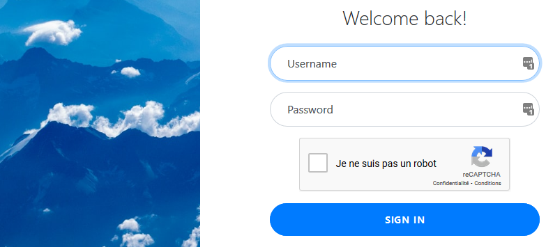

# STI Project 2
Authors: Bécaud Arthur, Egremy Bruno  
Fork from https://github.com/Naludrag/STIProject.

## Table of Content
- [Introduction](#introduction)
- [Installation/run](#install-run)
- [Usage](#usage)
	- [Credentials](#credentials)
	- [Login Page](#login)
	- [Database](#database)

## Introduction
As part of the STI course, we were asked to create a website that will simulate a web email system using a database without focusing on his security aspect.

For more information, such as the [project structure](https://github.com/Naludrag/STIProject#Structure) or the [user manual](https://github.com/Naludrag/STIProject#Usage), about the first project consisting of the basic implementation of the website, check out this [repository](https://github.com/Naludrag/STIProject).

After having the website done, we came to fix the security vulnerabilities through a threats analysis and a security patch. Check out the report ([md](./report.md), [pdf](./report.pdf)) document for more information.

## <a id="install-run"></a>Installation/run
To run the website without persistent data, use the following command.
```
docker run -it -d -p 8080:80 --name sti_project2 b3cauda/sti_project2
```
For a persistent database, or to edit the website, follow the next steps.
```
# Clone the project where you want it to be
git clone https://github.com/egremyb/STIProject.git
# Run the docker container and specify the volume location to 'site' folder
docker run -it -d -v /full/path/to/STIProject/site/:/usr/share/nginx/ -p 8080:80 --name sti_project2 b3cauda/sti_project2
```

Once the image is ready and running, you will be able to access the website through the http://localhost:8080 URL on your web browser.

## Usage
### Credentials
There are two default accounts with the provided SQLite database.

| Username | Password     | Role          |
|----------|--------------|---------------|
| admin    | N0t_e@5y     | Administrator |
| test     | t00_E@sY     | Collaborator  |

### <a id="login"></a>Login Page

The first page you will see when accessing the website is still the login page but it has been updated to prevent brute-force attacks using Google reCAPTCHAv2 technology.



### Database
The SQLite database is accessible at the http://localhost:8080/phpliteadmin.php URL.

The password is `!s9Tb87l*Te@Q65VFjnxOyGH$mXDqj`.
